#  Apiflux – Product Documentation


**[https://apiflux.in/](https://apiflux.in/)**

**Apiflux** is a developer-focused web application designed to help backend developers visually build, test, and debug API flows using a node-based interface. Inspired by tools like React Flow, the platform allows developers to connect API nodes and data transformation nodes into logical pipelines and execute them in a visual playground.

## Key Features

* **Visual Playground:** Drag-and-drop interface to build API and logic flows.
* **Node Types:**

  * **API Node:** For making HTTP requests with custom headers, method, body, etc.
  * **Transform Node:** For modifying or composing data between API calls using JavaScript-like functions.
* **Execution Engine:** Click "Play" to trigger the pipeline and visualize results at each step.
* **Color-Coded Handles:** Distinct source (outgoing) and target (incoming) connection points.
* **Apple-Inspired UI Theme:** Uses Apple’s color system for a modern and balanced UI.

## Target Audience

* Backend developers
* API architects
* DevOps engineers

## Use Cases

* Testing user registration flows (multi-step API logic)
* Debugging chained microservice requests
* Visualizing transformation logic

## Technology Stack

* **Frontend:** React + React Flow
* **Backend:** Node.js / Express (optional for MVP)
* **Styling:** CSS variables inspired by Apple Design System
* **Storage (MVP):** In-browser (localStorage) or simple cloud save

## Node Design

* **Handles:**

  * Source Handle: Green (`#10B981`)
  * Target Handle: Indigo (`#4F46E5`)
* **API Node Elements:** URL input, method selector, headers editor, body editor
* **Transform Node Elements:** Function input area with validation and output preview

## UI/UX Guidelines

* Balanced layout between the canvas (left) and configuration panels (right)
* Responsive form components for creating nodes and setting configurations
* Clear error states and feedback for failed API calls

## MVP Roadmap

### Phase 1 – Core Playground

* [x] Node-based drag-and-drop canvas
* [x] API node configuration
* [x] Transform node with JS function support
* [x] Execution engine with real API call capability

### Phase 2 – UX Improvements

* [ ] Node grouping / modular pipelines
* [ ] Execution logging
* [ ] Pipeline save/load/share features

### Phase 3 – Collaboration & Sharing

* [ ] User authentication
* [ ] Team flows and shared pipelines
* [ ] Export flows as code/scripts

## Future Enhancements

* GitHub integration
* CLI tool to generate visual pipelines from OpenAPI/Swagger specs
* Auto-suggest transformation functions

## Local Setup
Follow these steps to set up and run Apiflux locally:

### Prerequisites
- Node.js v18+
- Yarn 1.2+

1. **Clone the repository**
   ```bash
   git clone https://github.com/complex1/webflow-app.git
   cd webflow-app
   ```

2. **Install dependencies and build the project**
   ```bash
   node build.js
   ```
   This script will install dependencies for both client and server components.

3. **Start the server**
   ```bash
   yarn start
   ```
   The server will start on port 3000. You can access the application at http://localhost:3000

---

For more detailed documentation, visit [https://apiflux.in/docs](https://apiflux.in/docs)

For questions or feedback, contact the Apiflux team at \[[mauryas367@gmail.com](mailto:mauryas367@gmail.com)], visit our website at [https://apiflux.in/](https://apiflux.in/).
